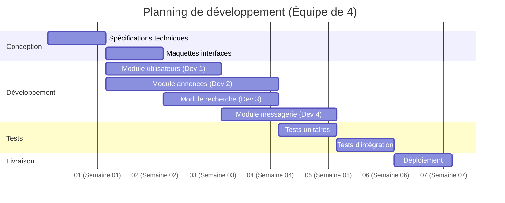

# Diagramme de Gantt - Projet Leboncoin Clone (Équipe de 4)

## Planning du projet (8 semaines)

## Répartition des ressources

| Tâche | Responsable | Durée | Équipe |
|-------|-------------|-------|--------|
| **Conception** | | | |
| Spécifications techniques | Chef de projet | 1 semaine | 1 |
| Maquettes interfaces | Designer | 1 semaine | 1 |
| **Développement** | | | |
| Module utilisateurs | Développeur 1 | 2 semaines | 1 |
| Module annonces | Développeur 2 | 3 semaines | 1 |
| Module recherche | Développeur 3 | 2 semaines | 1 |
| Module messagerie | Développeur 4 | 2 semaines | 1 |
| **Tests** | | | |
| Tests unitaires | QA | 1 semaine | 2 |
| Tests d'intégration | QA | 1 semaine | 2 |
| **Livraison** | | | |
| Déploiement | Ops | 1 semaine | 1 |

## Avantages de l'équipe de 4
- Parallélisation des tâches de développement
- Réduction du temps total de 11 à 8 semaines
- Spécialisation par module
- Capacité à mener tests en parallèle du développement

## Notes
- Les 4 développeurs travaillent en parallèle sur différents modules
- Période de tests réduite grâce à l'équipe QA dédiée
- Maintenance des dépendances entre modules
