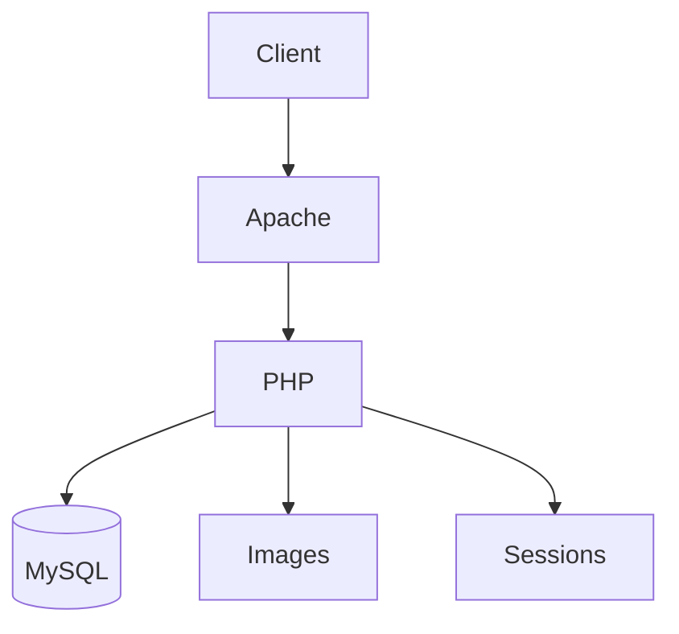
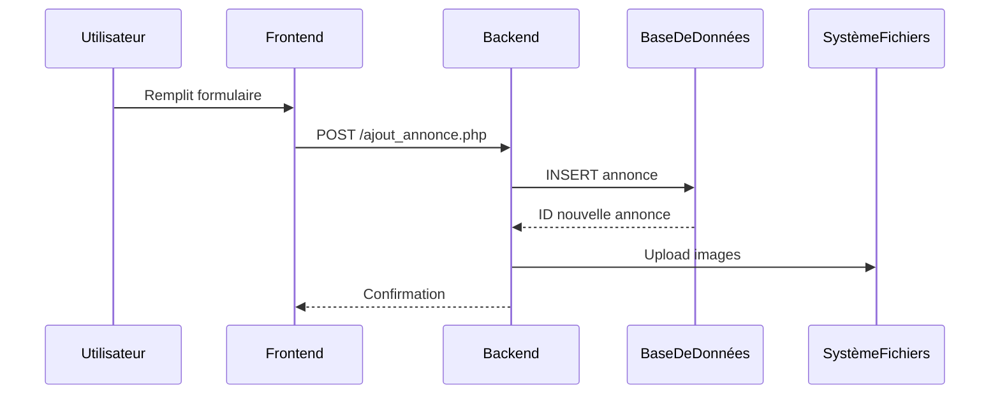

# Documentation Technique Avancée - Leboncoin Clone

## 1. Architecture Détaillée

### Schéma d'architecture


### Workflow des annonces


## 2. Base de Données - Détails Techniques

### Schéma relationnel complet
```sql
-- Table annonces
CREATE TABLE `annonces` (
  `id` int(11) NOT NULL AUTO_INCREMENT,
  `titre` varchar(255) NOT NULL,
  `description` text NOT NULL,
  `prix` decimal(10,2) NOT NULL,
  `user_id` int(11) DEFAULT NULL,
  `categorie_id` int(11) DEFAULT NULL,
  `date_creation` datetime DEFAULT current_timestamp(),
  `etat` enum('Neuf','Occasion') DEFAULT 'Occasion',
  PRIMARY KEY (`id`),
  FOREIGN KEY (`user_id`) REFERENCES `users`(`id`),
  FOREIGN KEY (`categorie_id`) REFERENCES `categories`(`id`)
) ENGINE=InnoDB;
```

### Index et performances
```sql
-- Index recommandés
CREATE INDEX idx_annonce_user ON annonces(user_id);
CREATE INDEX idx_annonce_categorie ON annonces(categorie_id);
CREATE FULLTEXT INDEX idx_recherche ON annonces(titre, description);
```

## 3. Code Critique - ajout_annonce.php

### Fonctionnalités clés
```php
// Gestion transactionnelle
$conn->begin_transaction();
try {
    // 1. Enregistrement annonce
    $stmt = $conn->prepare("INSERT INTO annonces (...) VALUES (...)");
    $stmt->execute();
    
    // 2. Traitement images
    foreach ($_FILES['photo'] as $file) {
        // Validation et upload
    }
    
    $conn->commit();
} catch (Exception $e) {
    $conn->rollback();
    throw $e;
}
```

### Sécurité renforcée
```php
// Protection XSS
$titre = htmlspecialchars($_POST['titre']);

// Validation des entrées
if (!in_array($etat, ['Neuf', 'Occasion'])) {
    throw new Exception("État invalide");
}

// Protection upload
$allowedTypes = ['image/jpeg', 'image/png'];
$fileType = mime_content_type($tmp_name);
if (!in_array($fileType, $allowedTypes)) {
    throw new Exception("Type de fichier non autorisé");
}
```

## 4. Workflows Complets

### Publication d'annonce
1. Vérification session utilisateur
2. Validation formulaire
3. Début transaction
4. Insertion annonce
5. Traitement images
   - Vérification taille (max 2Mo)
   - Vérification type (JPEG/PNG)
   - Redimensionnement si nécessaire
   - Enregistrement fichier
   - Insertion DB
6. Commit transaction
7. Redirection avec confirmation

### Recherche d'annonces
```sql
-- Requête typique avec pagination
SELECT a.*, u.nom, c.nom AS categorie 
FROM annonces a
JOIN users u ON a.user_id = u.id
JOIN categories c ON a.categorie_id = c.id
WHERE a.titre LIKE '%vélo%' OR a.description LIKE '%vélo%'
ORDER BY a.date_creation DESC
LIMIT 0, 20;
```

## 5. Bonnes Pratiques

### Sécurité
- Toujours utiliser des requêtes préparées
- Valider tous les inputs côté serveur
- Hasher les mots de passe (password_hash)
- Limiter les droits DB (GRANT)

### Performances
- Utiliser des transactions pour les opérations multiples
- Créer des index stratégiques
- Limiter les SELECT * aux champs nécessaires
- Implémenter la pagination

## 6. Journalisation et Monitoring

### Exemple de log
```php
// Dans config.php
function log_action($message) {
    $log = date('Y-m-d H:i:s') . " - " . $message . PHP_EOL;
    file_put_contents('../logs/app.log', $log, FILE_APPEND);
}

// Utilisation
log_action("Nouvelle annonce créée: ID $annonce_id");
```

### Points de monitoring
- Temps d'exécution des requêtes
- Erreurs SQL
- Échecs d'authentification
- Taux de réussite des uploads

## 7. Évolution du Projet

### Roadmap
1. Migration vers architecture MVC
2. Implémentation d'API REST
3. Système de notifications
4. Recherche avancée avec Elasticsearch
5. Cache Redis pour les requêtes fréquentes

### Refactoring recommandé
```php
// Au lieu de:
$stmt = $conn->prepare("INSERT INTO annonces (...) VALUES (...)");

// Adopter un ORM:
$annonce = new Annonce();
$annonce->titre = $request->get('titre');
$annonce->save();
